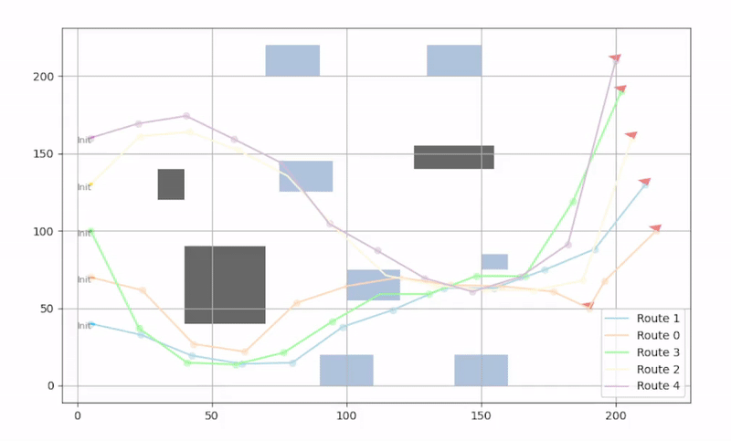
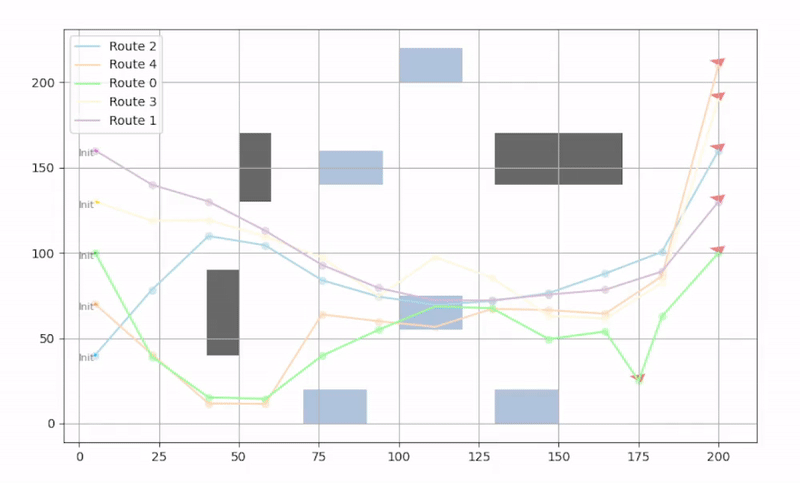

# MultiAgent_application
Trajectory planning project based on PSO and DRL techniques.  


## Folder structure
```

├── Docs                                            # Summary dev.
│   ├── DRL_notes.pdf
│   ├── env_code.pdf
│   └── PSO_versions.pdf
├── Guidance_controller                             # Main Algorithm
│   ├── 0_single_agent_v1                           # Single Agent Approach (Pytorch)
│   ├── 1_multiple_agent_v1                         # Stable Algorithm
│   │   ├── Aux_libs                                    #   Auxiliar functions
│   │   ├── control                                     #   Control Class
│   │   ├── DRL2                                        #   DRL Model Class manager
│   │   ├── Env                                         #   Environment Class manager
│   │   ├── ev3_utils                                   #   Auxiliar EV3 functions
│   │   ├── logging_data                                #   Storage
│   │   ├── model_test                                  #   Exported model in TensorFlow
│   │   ├── multi_control_replan_v1_wifi.py             #   Algorithm remote EV3 control through WiFi
│   │   ├── multi_sim_control_replan_v1.py              #   Main Algorithm (Stable* version)
│   └── Images
├── Hardware
│   ├── pc_test
│   ├── test_linux
│   ├── test_local_numpy_based                          # EV3 Local ALgortihm implementation 
│   └── test_python                                     # EV3 remote approach through Bluetooth
├── README.md
└── Simulation                                      # Isaac Simulation (exploration)
|   ├── 0_isaacGym_test1
|   ├── 1_IsaacGym_mpc_base
|   ├── Images
|   ├── notes.txt
|   └── README.md
|
└── README.md                                       

```


## Path Planning Algorithm Examples

### Scenario 5


### Scenario 4



